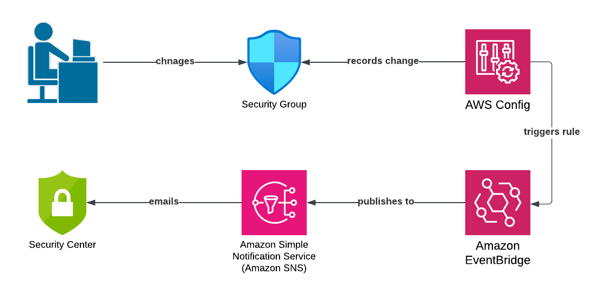

The purpose of the repository is to demonstrate how to use AWS Config to alert changes to a specific AWS resource.

In this example, I am monitoring changes to a Security Group.  Unlike the other monitoring examples, it is not necessary to explicitly create a Cloudtrail custom trail.  AWS Config is set up to record conifiguration changes to all Security Groups.  We use an EventBridge rule to listen for configuration item changes from Config regarding our specific Security Group.  Changes to other Security Groups will not trigger the Eventbridge rule.  The EventBridge rule triggers SNS to deliver the event to the given email address.  In total, a notification can arrive in your inbox less than a minute after the event takes place.  It is not necessary to use Config rules in this example.

Notes: 

If the Terraform cannot create the Config recorder because you have a pre-exisiting recorder, and you don't mind overwriting, use the following command and reapply the Terraform:

$ aws configservice delete-configuration-recorder --configuration-recorder-name default

